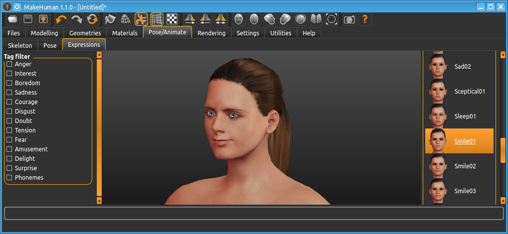
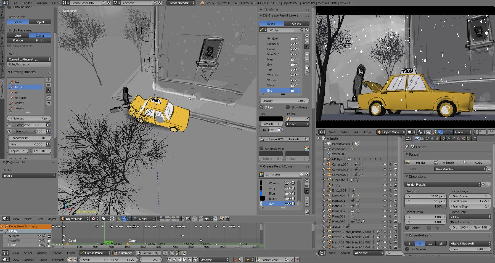

# MakeHuman

A tool for quickly creating 3D humans.

### [Download Link](http://www.makehumancommunity.org/content/downloads.html)

# Blender

A general purpose 3D modelling and animating tool. It also has a movie-quality renderer and various other tools.

### [Download Link](https://www.blender.org/download/)

# 3D Model Websites

Free 3D models! Using those saves you a ton of time, as long as you watch out for the licensing stuff. 

e.g. `CC Attribution` means that you have to give credits to the original author.

e.g. `Personal Use License` is a rather annoying license

- [Use Google to find a ton of them](https://www.google.com/search?gws_rd=cr&gl=us&hl=en&num=30&q=3d+models): **Recommended option**

- [SketchFab](https://sketchfab.com/models/categories/animals-pets?features=downloadable&sort_by=-likeCount): Has paid models and free models. Also, do note that not all of them are downloadable
- [Free3D](https://free3d.com/): Random 3D model website
- [NASA 3D Models](https://nasa3d.arc.nasa.gov/): For all of your [space](https://www.youtube.com/watch?v=xeKMS62GrTI) needs
- [BlendSwap](https://www.blendswap.com/): Lots of free Blender Models
- [Chocofur](https://store.chocofur.com/): Has paid and free models. All of them are really high quality

# Textures

Textures, when talking about 3D stuff, is just a fancy term for "pictures".

All of the following websites use the CC0 license, which gives you the right to do **whatever you want.** You can, for example, legally download all of their textures and sell them for $50 a piece.

- [CC0 Textures](https://cc0textures.com/): Materials such as "ground", "soil", "rocks"
- [cgbookcase](https://www.cgbookcase.com/): Materials such as "ground", "soil", "rocks"
- [HDRI Haven](https://hdrihaven.com/): "HDRI"s aka background images such as "sky", "town", "seaside"

## Photoshop and Krita

Photoshop is a really high quality product for editing pictures. A rather decent, free alternative is [Krita](https://krita.org/en/download/krita-desktop/).

# FlaxEngine 

Now, once you have all your 3D models, it's time to [do something with them](./images/artist_vs_programmer.jpg)!